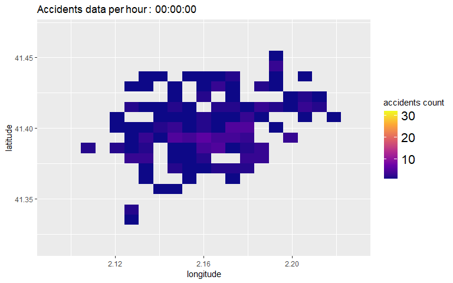

```{r, include = FALSE,options(warn=0)}
knitr::opts_chunk$set(
  collapse = TRUE,
  comment = "#>"
)

```
 
 

```{r warning=FALSE}
#loading the necessary libraries
library(TrafficAnalysis)
library(sf)
library(leaflet)
library(tidyverse)
library(gganimate)
library(gifski)
library(ggtext)
```
#Explatory Data Abalysis:
 In the preprocessing phase, the traffic accident data for the year 2017 was loaded from the "accidents_2017.csv" file and converted into a spatial data frame by incorporating longitude and latitude coordinates with a specified coordinate reference system. Unnecessary columns like "District.Name," "Neighborhood.Name," and "Part.of.the.day" were removed to optimize the dataset. The addition of a constant "Year" column with a value of 2017 and converting the "Month" column into numeric representation using a predefined dictionary ensured consistent time representation. A new "datetime" column was created by combining "Day," "Month," "Year," and "Hour" to facilitate time-based analysis. Redundant "Month," "Day," "Hour," "Year," and "Weekday" columns were eliminated. Additionally, duplicate records were removed, resulting in a refined and structured dataset, poised for further in-depth analysis of accident patterns and trends.
```{r}
calculate_summary_stats(accidents2017)
```
The observed decrease in the number of accidents during August and December can be attributed to seasonal variations in traffic patterns. In August, the "summer vacation effect" likely leads to fewer people commuting to work, resulting in reduced traffic volume and a lower likelihood of accidents. Similarly, in December, festive holidays and social gatherings may lead to decreased work-related travel and fewer vehicles on the road during specific days or hours. While weather conditions and law enforcement efforts may also influence accident rates during these months, the overall trend highlights the importance of considering seasonal factors in road safety measures. Policymakers and traffic safety experts should remain vigilant in adapting strategies to ensure road users' well-being during periods of varying traffic activity.

```{r}
perform_monthly_analysis(accidents2017)

#accidents_month
# Print the plot
#print(p)
```
After naking the monthly anaylsis of the accident, its important to see the distribution of the accidents in the weekdays to understant the patterns in which the accidents are likely happen and , Based on the result the accidents are so down in the weekends days ,it make sense because most of the perople are not going work at weekend days and in the accidents are high on fridays the reason is that in fridays many went for paraty.

##Weekdays Accidents
```{r}
#library(viridis)
data<-perform_weekdays_analysis(accidents2017)
    p <- ggplot(data, aes(x = day_of_week, y = num_accidents)) +
      geom_bar(stat = "identity", fill = "magenta", alpha = 0.5) +
      labs(title = "Accidents in Barcelona in 2017",
           x = "Day of the week",
           y = "Number of accidents") +
      theme_minimal() +
      theme(axis.text.x = element_text(angle = 45, hjust = 1))

    # Set the figure size
    options(repr.plot.width = 12, repr.plot.height = 7)

    # Print the plot
    print(p)
 # image(p,col=viridis(200))
```
From the above information, sunday is the day where the lowest accident recoreded and Fridays is the highest accident recoreded, so it make sense to see the number of each accidents per each days of the year. From the result
```{r}
#
accidents_data <-perform_eachday_year(accidents2017)
    p <- ggplot(accidents_data, aes(x = date, y = num_accidents)) +
      geom_line(color = "blue") +
      geom_point(data = filter(accidents_data, weekdays(date) == "Sunday"), aes(color = "Sunday", shape = "Sunday"), size = 3, show.legend = TRUE) +
      geom_point(data = filter(accidents_data, weekdays(date) == "Friday"), aes(color = "Friday", shape = "Friday"), size = 3, show.legend = TRUE) +
      labs(title = "Accidents in Barcelona in 2017",
           x = "Date",
           y = "Number of accidents per day",
           color = "Day of the Week",
           shape = "Day of the Week") +
      scale_color_manual(values = c("Sunday" = "green", "Friday" = "red")) +
      scale_shape_manual(values = c("Sunday" = 16, "Friday" = 17)) +
      theme_minimal()

    # Set the figure size
   # options(repr.plot.width = 13, repr.plot.height = 8)

    # Print the plot
    print(p)
```
####Location Based Analysis

```{r}
#Location based Analysis
Display_Serious_injuries(accidents2017)
```

This function clusters the accidents ,The provided plot illustrates car accidents involving victims with severe injuries, similar to the previous depiction. However, in this instance, the accidents are organized into distinct clusters.
```{r}
Display_clusteraccident_serious(accidents2017)
```

#Hotspot analsysis
In this section,i am leverging the package called sfhotspot to analysis my data by using its methods:
hotspot_count():	Count the number of points in each cell of a regular grid. Cell size can be set by the user or chosen automatically.
hotspot_kde():	Estimate kernel density for each cell in a regular grid. Cell size and bandwidth can be set by the user or chosen automatically.
hotspot_gistar():	Calculate the Getis–Ord Gi* statistic for each cell in a regular grid, while optionally estimating kernel density. Cell size, bandwidth and neighbour distance can be set by the user or chosen automatically.

```{r}
#Display all the accidents data on the study area,
ggplot(accidents2017) + 
  ggspatial::annotation_map_tile(type = "cartolight", zoomin = 0, quiet = TRUE) +
  
  geom_sf(alpha = 0.1,size=2) + 
  theme_minimal()

```

```{r}
#The function hotspot_count()  produces an SF object with counts for the number of points in (by default) each cell in a grid of cells.
#based on the output ,the n represents the number of accidents per grid cell
hotspotcount <- perform_hotspot_count(accidents2017)
ggplot() +
 ggspatial::annotation_map_tile(type = "cartolight", zoomin = 0, quiet = TRUE) +
  geom_sf(
    mapping = aes(fill = n),
    data = hotspotcount,
    alpha = 0.75,
    colour = NA
  ) +
  scale_fill_distiller(direction = 1)
```

The fucntions helps to visualize the hotspots by showing only those cells that have significantly more points than expected by chance. For those cells, show the estimated  density of accidents.
```{r message=FALSE,warning=FALSE}
results<-Perform_hotspotsf(accidents2017)
results %>% 
  filter(gistar > 0, pvalue < 0.05) %>% 
  ggplot(aes(colour = kde, fill = kde)) +
  geom_sf() +
  scale_colour_distiller(aesthetics = c("colour", "fill"), direction = 1) +
  labs(title = "Density of Accidents in Barcelona, 2017") +
  theme_void()
```

This function can be used to calculate kernel density estimates for each cell in a grid. The kernel density estimation (KDE) can be customised using the bandwidth and bandwidth_adjust arguments.If you do not specify any optional arguments,   hotspot_kde() will try to choose reasonable default values. The KDE algorithm requires projected co-ordinates (i.e. not longitudes and latitudes), so we must first transform the data to use an appropriate local projected co-ordinate system.
Based on output from kernel density estimationa  Accidents are more concentrated on the central part of barcelona, which make sense that most of the traffic jams are occured.

```{r message=FALSE, results='hide'}

output <- capture.output({

  results <- perform_hotspot_kde(accidents2017)
  
  ggplot() +
    ggspatial::annotation_map_tile(type = "cartolight", zoomin = 0, quiet = TRUE) +
    geom_sf(
      mapping = aes(fill = kde),
      data = results,
      alpha = 0.75,
      colour = NA
    ) +
    scale_fill_distiller(direction = 1)
})

# Filter out lines containing the progress information
clean_output <- output[!grepl("^Done:", output)]

# Print the cleaned output
cat(clean_output, sep = "\n")
```


```{r gganimate_chunk, animation.fun = gifski_renderer() }
#to display the animated heatmap for the 
library(gifski)
library(gganimate)
library(ggtext)

#animation::use_renderer(gifski_renderer())
animated_heatmap<-Display_AnimatedHeatMap(accidents2017)

anim_save("heatmap_animation.gif", animation = animated_heatmap,
            ani.width = 800, ani.height = 600,
           title = "Accidents Heatmap Animation")
#my_options <- list(ani.width = 800, ani.height = 600)



```


